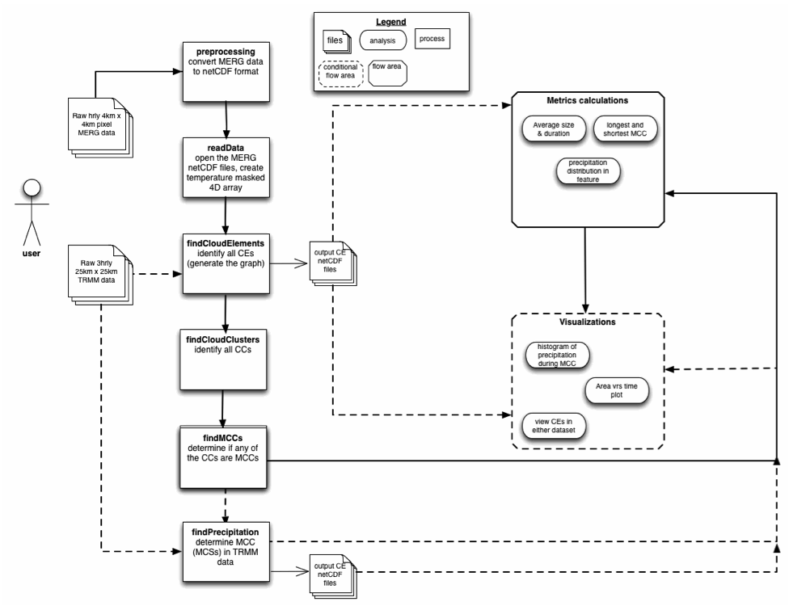

# Graph-based Search for the Identification and Chatacterization of Mesoscale Convective Complexes

## Introduction and Context
This program searches for a weather feature known as a Mesoscale Convective Complex (MCC) in gridded infrared and precipitation rate satellite data (MERG and TRMM datasets have been tested). 
The work is direct output from [Kim Whitehall's](http://www.kimwhitehall.com/) Ph.D. thesis which acts as the basis and driver for inclusion in OCW.

Data from MERG and TRMM datasets is read from netCDF files into arrays with the dimensions time, latitude, longitude, value. From the data we can then infer and generate a number of things:
 * a graph representing Cloud Elements (CE)
 * analysis of the graph to determine whether any Cloud Clusters (CC) are present
 * determination of whether any of the CC are MCC
 * futher metrics calculation and analysis with a specific focus on MCC examples of which include average size and duration, longest and shortest, precipitation distribution in feature
 * numerous visualizations including histograms of precipitation during MCC, area Vs time plots, cross dataset visualization of CE... 
If you are still reading this file it means that you wish to use the mccsearch program, or learn more about it within the context of OCW.

## What is needed?
 * Python (verified with 2.7.4) - http://python.org
 * netCDF4 (verified with netCDF4-1.1.1)- http://www.unidata.ucar.edu/software/netcdf/
 * sciPy (verified with 0.14.0)- http://www.scipy.org/scipylib/index.html
 * NumPy (verified with 1.9.0)- http://www.scipy.org/scipylib/download.html
 * Networkx (verified with 3.4.0) - https://networkx.github.io/download.html
 * matplotlib (verified with 1.4.0)- http://matplotlib.org/downloads.html
 Optional if preprocessing of raw MERG files is required
 * LATS4D - http://sourceforge.net/projects/opengrads/files/

So, without further a-do, lets progress with using mccsearch.

## Source Code
 * [mccSearch.py](../code/mccSearch.py) contains the primary MCC functionality
 * [mccSearchUI.py](../code/mccSearchUI.py) contains a wizard type Q&A for running the mccSearch program
 * [mainProg.py](../code/mainProg.py) contains a sample of the  general workflow of the order the modules should be called. You will have to supply three main input arguments:
     * mainDirStr : a directory where you wish all the output files –images, textfiles, clipped netCDF files- to be stored
     * TRMMdirName : a directory containing the original TRMM data in netCDF format
     * CEoriDirName : a directory containing the original MERG data in netCDF format
  
## Download MERG and TRMM data
The following assumptions are made:
 * Input data are in one folder. mainProg.py looks for MERG data as a single directory 'CEoriDirName' and TRMM data as a single directory 'TRMMdirName', just as described above. These directories cannot be the same and the data all needs to be of type netCDF data files only.
 * There is RUDIMENTARY FILE checking that ensures ALL files between the times requested are in the folder requested in netCDF format. 
 * THERE IS NO FILE ERROR HANDLING. Please ensure that the MERG data and the TRMM data files are correlated temporally and spatially

## Run mccSearchUI.py
As a first try to determine the workflow, run the mccSearchUI.py wizard. 

## Configure mainProg.py
Guidance on the workflow can be seen in the figure below. More details on individual functions in mccSearch.py can be found in the DocStrings. 

The general workflow of the program. The dashed lines indicate optional paths. 

## Run mainProg.py
Keep your fingers & toes crossed!! Once everything went well, the directory you indicated where outputs should be stored will be generated, and four folders should appear in it. 
 * The image folder will store all images generated from plots.
 * The textFiles folder will store all the text files generated during the run, e.g. cloudElementsUserFile.txt that contains information about each cloud element identified
 * The MERGnetcdfCEs folder contains the infrared data in clipped netCDF files that have been generated for each cloud element identified
 * The TRMMnetcdfCEs folder contains the precipitation data in clipped netCDF files that have been generated for each cloud element identified.

## Anticipated future work
 * Implement functionality for file checking to ensure all files are there
 * Create a user interface based on mainProg.py. 
 * Plug the project into the Regional Climate Model Evaluation Database (RCMED) that is available at Apache OCW. 
With increased usage, it is anticipated that more metrics and visualizations will be provided. 
 * There are a [number of issues](http://s.apache.org/mccsearch) in the OCW Jira relating to mccsearch. If you find an issue, please [open an issue](https://issues.apache.org/jira/browse/climate) and tag it with the [mcc search](http://s.apache.org/mccsearch) tag.
