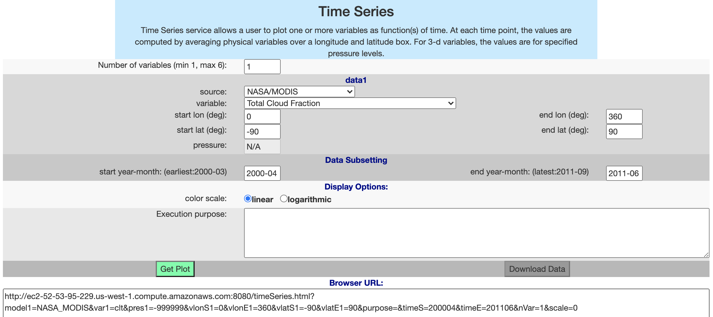
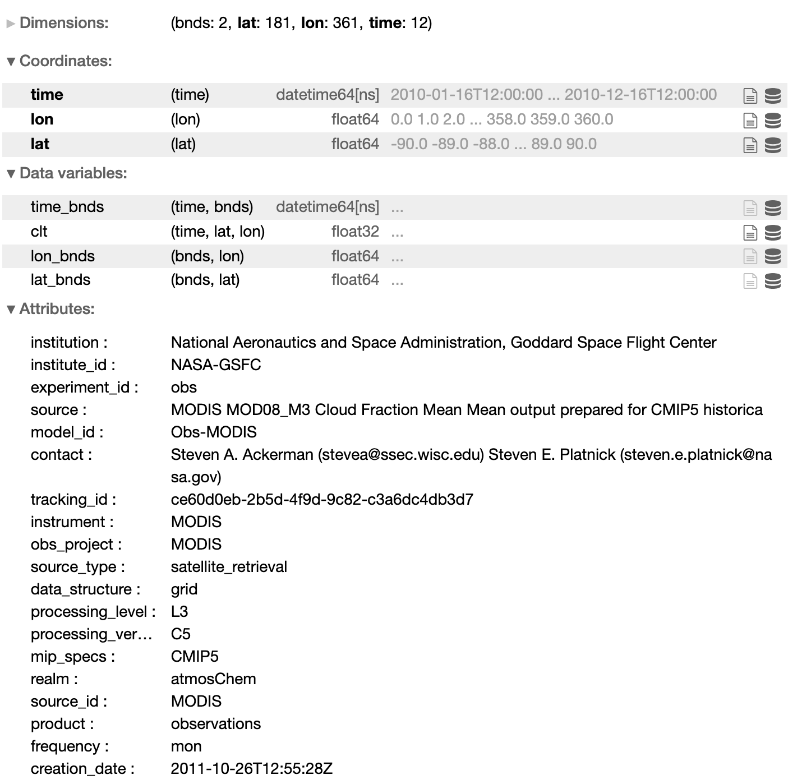

# Climate Model Diagnostic Analyzer API
[](https://mybinder.org/v2/gh/agoodm/cmda_notebooks/master)

The [CMDA services](http://ec2-52-53-95-229.us-west-1.compute.amazonaws.com:8080/) are available with a Python interface via scripts or as a GUI powered by Jupyter Notebooks.

## Getting Started
### 1. Choose a service from the [web API](http://ec2-52-53-95-229.us-west-1.compute.amazonaws.com:8080/)

### 2. Build a query. 
This can be done via the web interface: 



or via a python script by analyzing the format of "Browser URL". The URL can be deconstructed into a dictionary and used as arguments in an API call. 

```python
import requests

# Generate data remotely
cmda_url = 'http://ec2-52-53-95-229.us-west-1.compute.amazonaws.com:8080/svc/timeSeries'

query = dict(
    model1='NASA_MODIS',
    var1='clt',
    pres1=-999999,
    vlonS1=0,
    vlonE1=360,
    vlatS1=-90,
    vlatE1=90,
    purpose='',
    timeS=200004,
    timeE=201106,
    nVar=1,
    scale=0
)

r = requests.get(cmda_url, params=query)
print(r.url)
print(r.status_code)
```

- If you're unsure which datasets are available, visit the [Data Table](http://ec2-52-53-95-229.us-west-1.compute.amazonaws.com:8080/datasetTable.html) to explore the available measurements from satellite observations and Earth climate models


### 3. Download the data

Click "Download Data" on the web api to download a [Net CDF](https://en.wikipedia.org/wiki/NetCDF) file containing the data. 

Or use python to download the Data File URL directly into code:

```python
import xarray

# Download data into xarray Dataset object
def download_data(url):
    r = requests.get(url)
    buf = BytesIO(r.content)
    return xr.open_dataset(buf)

data_url = r.json()['dataUrl'] # Data File URL
ds = download_data(data_url)
```

The Net CDF file will be downloaded directly into an Xarray [DataSet Object](http://xarray.pydata.org/en/stable/generated/xarray.Dataset.html). In a Jupyter notebook the dataset object can be explored interactively. From here the data is ready for analysis



### 4. Create a plot
Use the Xarray object to create a plot using [Holo Views](http://holoviews.org/). Interactive plots with [Bokeh](https://docs.bokeh.org/en/latest/index.html) are automatically created using holo views in a Jupyter Notebook.

```python
import cartopy.crs as ccrs 

ds.clt.hvplot.quadmesh('lon', 'lat', widget_location='bottom', projection=ccrs.PlateCarree(), crs=ccrs.PlateCarree(), geo=True, coastline=True)
```


Each of the CMDA services are available in their own Jupyter Notebook for reference