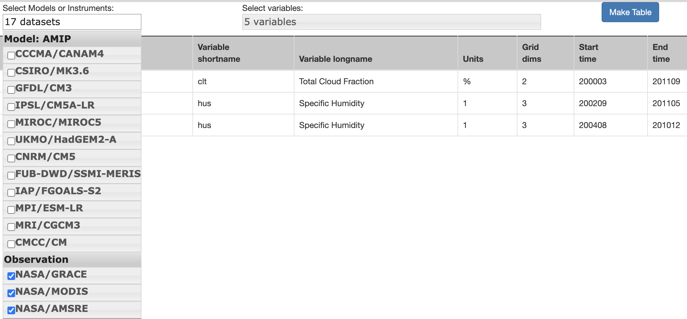

# Climate Model Diagnostic Analyzer API
[](https://mybinder.org/v2/gh/agoodm/cmda_notebooks/master)

Use the [CMDA services](http://ec2-52-53-95-229.us-west-1.compute.amazonaws.com:8080/) with a programming interface or a GUI in a Jupyter notebook

# [Data Table](http://ec2-52-53-95-229.us-west-1.compute.amazonaws.com:8080/datasetTable.html)
Explore the available measurements from satellite observations and various Earth models




# [Universal Plotting Service](http://ec2-52-53-95-229.us-west-1.compute.amazonaws.com:8080/universalPlotting3b.html)
Plot measurements from any observation or model


# Programming Interface

## Create a query
```python
import requests

# Generate data remotely
cmda_url = 'http://ec2-52-53-95-229.us-west-1.compute.amazonaws.com:8080/svc/regridAndDownload'

# build query
query = dict(
    model1='NASA_MODIS',
    var1='clt',
    pres1=-999999,
    purpose='',
    timeS=201001,
    timeE=201012,
    lonS=0,
    lonE=360,
    latS=-90,
    latE=90,
    dlon=1,
    dlat=1
)

r = requests.get(cmda_url, params=query)
print(r.url)
print(r.status_code)
```
## Download the data
```python
import xarray
# Download data into xarray Dataset object
def download_data(url):
    r = requests.get(url)
    buf = BytesIO(r.content)
    return xr.open_dataset(buf)

data_url = r.json()['dataUrl']
ds = download_data(data_url)
```

## Create a plot
```python
import cartopy.crs as ccrs 

ds.clt.hvplot.quadmesh('lon', 'lat', widget_location='bottom', projection=ccrs.PlateCarree(), crs=ccrs.PlateCarree(), geo=True, coastline=True)
```


The Jupyter notebooks contain interactive plots